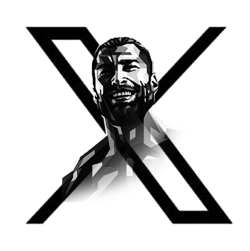

<!-- Improved compatibility of back to top link: See: https://github.com/CMP25-SWE-TEAM1/Cross-platform/pull/73 -->
<a name="readme-top"></a>
<!--
*** Thanks for checking out the Best-README-Template. If you have a suggestion
*** that would make this better, please fork the repo and create a pull request
*** or simply open an issue with the tag "enhancement".
*** Don't forget to give the project a star!
*** Thanks again! Now go create something AMAZING! :D
-->


<!-- PROJECT SHIELDS -->
<!--
*** I'm using markdown "reference style" links for readability.
*** Reference links are enclosed in brackets [ ] instead of parentheses ( ).
*** See the bottom of this document for the declaration of the reference variables
*** for contributors-url, forks-url, etc. This is an optional, concise syntax you may use.
*** https://www.markdownguide.org/basic-syntax/#reference-style-links
-->
[![Contributors][contributors-shield]][contributors-url]
[![Forks][forks-shield]][forks-url]
[![Stargazers][stars-shield]][stars-url]
[![Issues][issues-shield]][issues-url]
[![MIT License][license-shield]][license-url]


<!-- PROJECT LOGO -->
<br />
<div align="center">
  <a href="https://github.com/CMP25-SWE-TEAM1/Cross-platform">
    
  </a>

  <h3 align="center">GigaChat</h3>

  <p align="center">
    This project entailed the development of a comprehensive Twitter clone, meticulously replicating core functionalities and incorporating additional features to enhance user experience. The project was executed through a collaborative team effort, spanning both front-end, cross platform, testing, DevOps and back-end development.
    <br />
    <a href="https://github.com/CMP25-SWE-TEAM1"><strong>Explore the project</strong></a>
    <br />
    <br />
    <a href="https://github.com/CMP25-SWE-TEAM1/Cross-platform">Crossplatform demo</a>
    ·
    <a href="https://github.com/CMP25-SWE-TEAM1/Cross-platform/issues">Report Bug</a>
    ·
    <a href="https://github.com/CMP25-SWE-TEAM1/Cross-platform/issues">Request Feature</a>
  </p>
</div>


<!-- TABLE OF CONTENTS -->
<details>
  <summary>Table of Contents</summary>
  <ol>
    <li>
      <a href="#about-the-project">About The Project</a>
      <ul>
        <li><a href="#built-with">Built With</a></li>
        <li><a href="#features">Features</a></li>
      </ul>
    </li>
    <li>
      <a href="#getting-started">Getting Started</a>
      <ul>
        <li><a href="#flutter">Flutter</a></li>
        <li><a href="#ide">IDE</a></li>
        <li><a href="#setting-up-server">Setting up server</a></li>
      </ul>
    </li>
    <li><a href="#contributing">Contributing</a></li>
    <li><a href="#license">License</a></li>
    <li><a href="#contact">Contact</a></li>
    <li><a href="#Special-Thanks-to">Special Thanks to</a></li>
    
  </ol>
</details>


<!-- ABOUT THE PROJECT -->
## About The Project

This is the crossplatform part of a twitter-clone project, which was our 3rd year project in CMP CUFE, feel free to have fun testing with it.
The project supports building into Android (tested) , IOS (not tested) , Windows (tested) & Web (lightly tested).

This project is left for future CMP students who want to get involved into flutter and see how a real-life fully-intergated flutter application looks like, Have fun guys !

Screenshots of the 

### Built With

[![Flutter][flutter-shield]][flutter-url]

<p align="right">(<a href="#readme-top">back to top</a>)</p>


## Features

we implemented most of the core features of tweetter while also changing some of them to match our project, or even adding more.

### Authentication and Registration
* Loging & Register using the mobile or the Disktop version
* Email confirmation and password reset mechanisms
* we also integrated third-party sign-in options , Ex: Google-sign-in (Android Only)
* Functionalities for updating usernames, passwords, and email addresses

### User Profiles
* Comprehensive profile management, including customizable profile pictures and banners
* Searching for other users and managing interactions between them (follow , like , ...)
* View and update users profiles (shout out to ma man [Elkapeer](https://github.com/Elkapeer))

### Tweets
* Creating, deleting, liking & viewing tweets
* Adding & removing replies to tweets
* Responsivly loading tweets into the application feed (dont mention the word "feed" in front of [Mohammed](https://github.com/MoAdelEzz) or he's gonna murder you ..)
* viewing lists of various tweet informations, Ex: likers list ...  

### Timeline & Trends
* Personalized home timelines showcasing tweets from followed users
* Filtering tweets based on mentions and likes
* Trend exploration, including tweet displays for specific trends
* Searching for certain tweets

### Direct messages
* DM System to send & recieve chats, videos & images between users with independently of the platform the user uses
* Searching messages using text
* Unread / read messages display
* Pinning certain chats to top

### Media
* intergation of media (images, video, audio) into Direct messages & tweets

### Notifications
* Push Notifications for varies users actions (like, mute, ...)
* Chat Notifications for direct messages


<p align="right">(<a href="#readme-top">back to top</a>)</p>

<!-- GETTING STARTED -->
## Getting Started

To get started into this project localy, you need to have the follow 

### Flutter

This project is developed in flutter, you will be required to insall flutter from [this][flutter-url] link, you can follow the step-by-step installation in the flutter website or any yt video will do, its really simple to install.

### IDE

This isn't really any mandatory IDE for flutter, in our case we used [Android Studio](https://developer.android.com/studio) to develop the app, but other ides
like [VS Code](https://code.visualstudio.com/) can also be used

### Setting Up Server

To be able to test the application, you need to have an active API of the backend.
the backend code can be found in [This](https://github.com/CMP25-SWE-TEAM1/Backend) repo, follow their steps to setup a local server.

you will also need to change these parts of the code inside [base.dart](https://github.com/CMP25-SWE-TEAM1/Cross-platform/blob/master/lib/base.dart)
```flutter
const String API_LINK = "backend.gigachat.cloudns.org";
const String API_WEBSOCKS_LINK = "http://51.116.199.56:5750/";
```
with the respective backend ip / url

<!-- CONTRIBUTING -->
## Contributing

Contributions are what make the open source community such an amazing place to learn, inspire, and create. Any contributions you make are **greatly appreciated**.

This project was developed by these awesome people. 

<table>
  <tr>
<td align="center">
<a href="https://github.com/AbdoWise-z" target="_black">
<br /><sub><b>Abdulrahman Mohammed </b></sub> <br/> (team lead) </a>
</td>

<td align="center">
<a href="https://github.com/Elkapeer" target="_black">
<br /><sub><b>Osama Saleh</b></sub><br/> (member) </a>
</td>

<td align="center">
<a href="https://github.com/MoAdelEzz" target="_black">
<br /><sub><b>Mohammed Adel Mohammed</b></sub> <br/> (member)</a>
</td>

<td align="center">
<a href="https://github.com/A-OMAR-1234" target="_black">
<br /><sub><b>Ahmed Mohammed Omar</b></sub><br/> (member)</a><br />
</td>

</tr>
 </table>


If you have a suggestion that would make this better, please fork the repo and create a pull request. You can also simply open an issue with the tag "enhancement".
Don't forget to give the project a star! Thanks again!

1. Fork the Project
2. Create your Feature Branch (`git checkout -b feature/AmazingFeature`)
3. Commit your Changes (`git commit -m 'Add some AmazingFeature'`)
4. Push to the Branch (`git push origin feature/AmazingFeature`)
5. Open a Pull Request

<p align="right">(<a href="#readme-top">back to top</a>)</p>


<!-- LICENSE -->
## License

Distributed under the MIT License. See `LICENSE.txt` for more information.

<p align="right">(<a href="#readme-top">back to top</a>)</p>


<!-- CONTACT -->
## Contact

[Abdulrahman Mohammed Abdulfattah](https://www.linkedin.com/in/abdo-mohamed-5b3506252/) - moh2002.abdow@gmail.com

[Osama Saleh Farag](https://github.com/Elkapeer)

[Mohammed Adel Mohammed](https://www.linkedin.com/in/mohammed-adel-mohammed-ezz-eldin-115609245/)

[Ahmed Mohammed Omar](https://github.com/A-OMAR-1234)

<p align="right">(<a href="#readme-top">back to top</a>)</p>


## Special Thanks to
* Our backend team for making our lifes a living hell (I'm never forgetting that notification issue).
* [Mohammed Adel Mohammed](https://www.linkedin.com/in/mohammed-adel-mohammed-ezz-eldin-115609245/) and [Osama Saleh Farag](https://github.com/Elkapeer) for 
managing to survive this hell of a project, good jop guys.
* [Ahmed Mohammed Omar](https://github.com/A-OMAR-1234) you fox you.


<!-- MARKDOWN LINKS & IMAGES -->
<!-- https://www.markdownguide.org/basic-syntax/#reference-style-links -->
[contributors-shield]: https://img.shields.io/github/contributors/othneildrew/Best-README-Template.svg?style=for-the-badge
[contributors-url]: https://github.com/CMP25-SWE-TEAM1/Cross-platform/graphs/contributors

[forks-shield]: https://img.shields.io/github/forks/othneildrew/Best-README-Template.svg?style=for-the-badge
[forks-url]: https://github.com/CMP25-SWE-TEAM1/Cross-platform/network/members

[stars-shield]: https://img.shields.io/github/stars/othneildrew/Best-README-Template.svg?style=for-the-badge
[stars-url]: https://github.com/CMP25-SWE-TEAM1/Cross-platform/stargazers

[issues-shield]: https://img.shields.io/github/issues/othneildrew/Best-README-Template.svg?style=for-the-badge
[issues-url]: https://github.com/CMP25-SWE-TEAM1/Cross-platform/issues

[license-shield]: https://img.shields.io/github/license/othneildrew/Best-README-Template.svg?style=for-the-badge
[license-url]: https://github.com/CMP25-SWE-TEAM1/Cross-platform/blob/master/LICENSE.txt

[flutter-shield]: https://img.shields.io/badge/-flutter-blue?logo=flutter&logoColor=f5f5f5
[flutter-url]: https://flutter.dev/